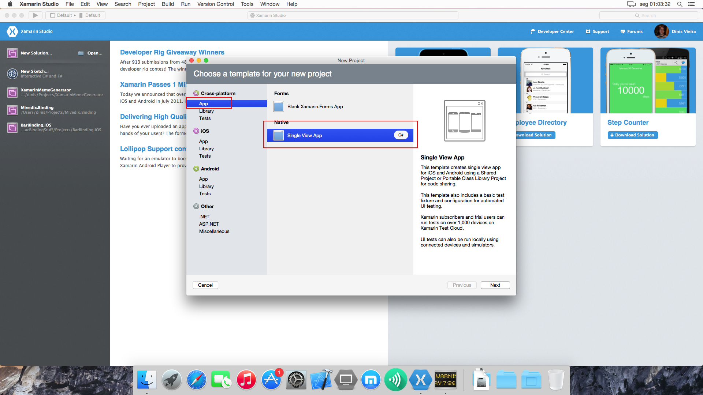
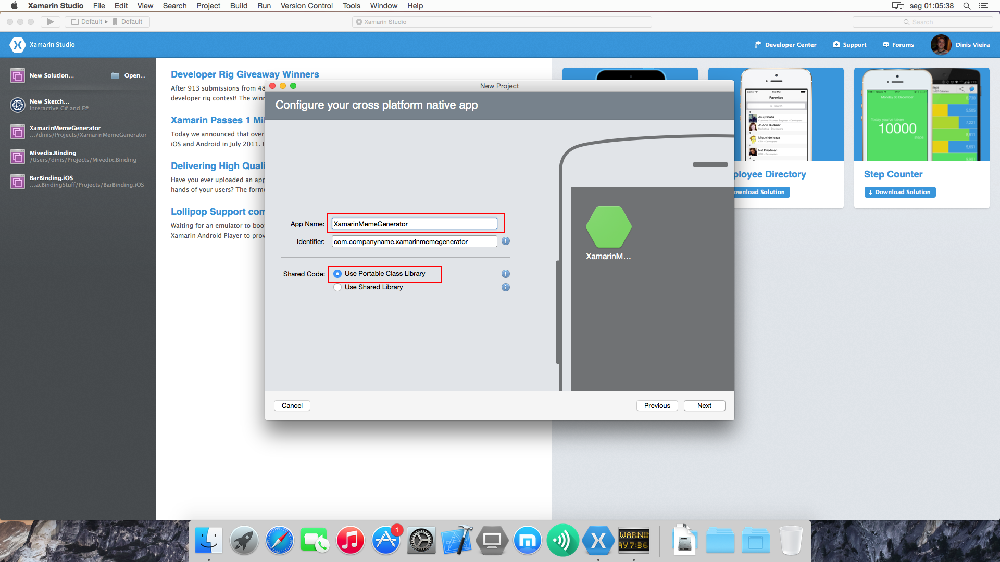
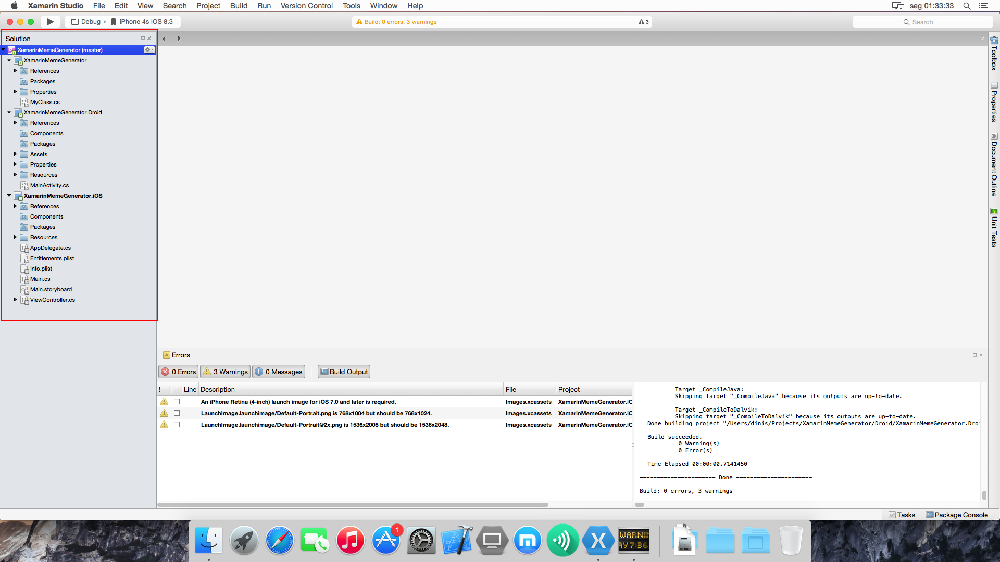
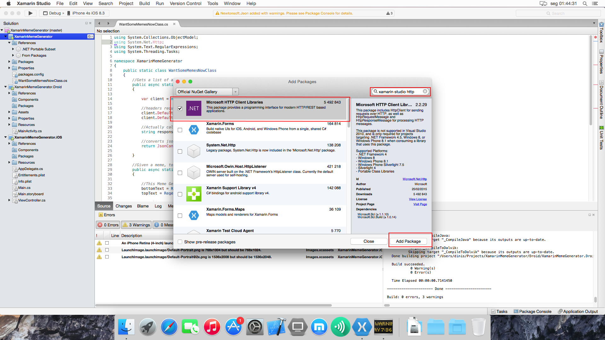
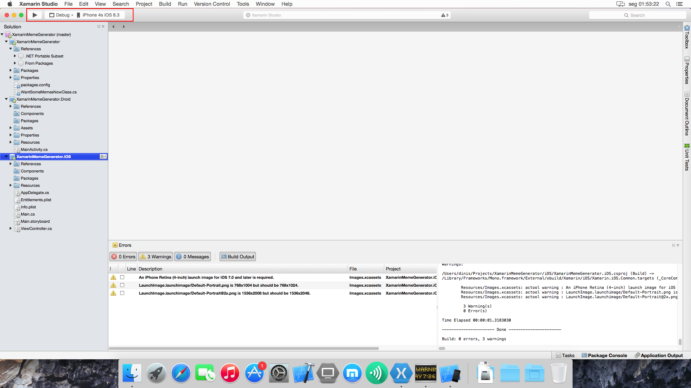
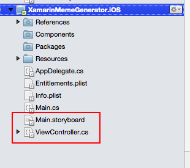
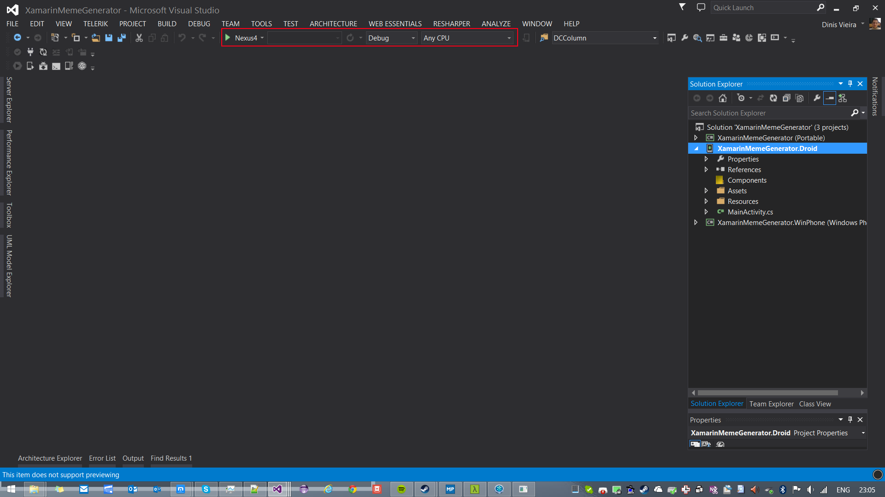
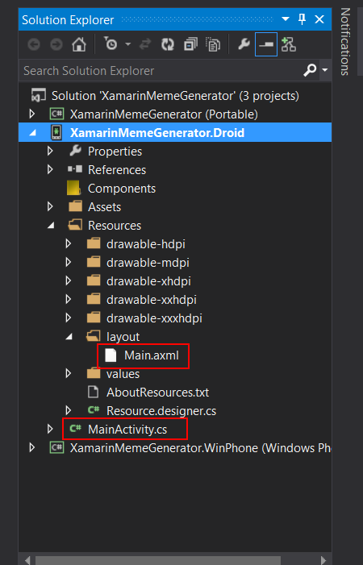

# Track 2 - Development with Mac #
You will develop an iOS and Android application.  

## Before starting

* Make sure you have [Xamarin](http://developer.xamarin.com/guides/cross-platform/getting_started/introducing_xamarin_studio/) (and Xamarin Studio) installed :)

## Create Project

Open Xamarin Studio.

* 1) File => New => Solution

* 2) Choose Cross-Platform => App => Single View App => Next

* 3) Give it a name => Choose "Use Portable Class Library" => Next => (in the next page just press Create)

Xamarin Studio will generate a template for Android / iOS using a Portable Class Library to share code.

You Solution Explorer should look like this now:

> + XamarinMemeGenerator is our Portable Class Library, meant to share code between platforms.
> + XamarinMemeGenerator.Droid is the project specific to the Android platform.
> + XamarinMemeGenerator.iOS is the project specific to the iOS platform.

> Testing is important, but for this Workshop purposes you can delete the "UITests" project.

* 4) Login / Create Xamarin Account (this might not be necessary if you have already done it in the past.
	* Xamarin Studio => Account => Login (Create Account if necessary)

## Let's get some work done

So, we want to build an application capable of building [Meme's](http://gizmodo.com/what-exactly-is-a-meme-512058258), for that we'll need to use an API that gives us a list of meme's and then allows us to send it the selected meme, some captions and return a meme image.

This is the screenshot of the application we want to build (Android version).

### Create shared code that accesses the Meme Generation API

* 1) In the XamarinMemeGenerator Project delete the "MyClass.cs"
	* Right-click the MyClass.cs file and select "Remove"
* 2) Create a new Class called "WantSomeMemesNowClass.cs" (or something else you want, I'm not good with names :)
	* Right-click the XamarinMemeGenerator Project => Add => New file => Choose "Empty Class" from the list, give it a name and click "New"

* 3) This is definteley cheating, but here goes the code for this class...

		public static class WantSomeMemesNowClass
		{
			//Gets a list of all available memes on this API
			public async static Task<ObservableCollection<string>>  ShowMeThoseMemes()
			{
		
				var client = new HttpClient();
		
				//headers required to call the service (API key and Accept type)
				client.DefaultRequestHeaders.Add("X-Mashape-Key", "4wOkBMq0J3mshTsxRwUGu2H2tP9kp1UK1XGjsnSSX7cxmwWcZL");
				client.DefaultRequestHeaders.Add("Accept", "text/plain");
		
				//Actually calls the service and returns a json string
				string response = await client.GetStringAsync("https://ronreiter-meme-generator.p.mashape.com/images");
		
				//converts json string to na ObservableCollection of strings
				return JsonConvert.DeserializeObject<ObservableCollection<string>>(response);
		
			}
			
			//Given a meme, top and bottom texts this will return an image
			public async static Task<byte[]> GenerateMyMeme(string meme, string topText, string bottomText)
			{
		
				//This Meme Generator Api has a problem with non-ascii chars, so we strip them just to avoid it crashing.
				bottomText = Regex.Replace(bottomText, @"[^\u0000-\u007F]", string.Empty);
				topText = Regex.Replace(topText, @"[^\u0000-\u007F]", string.Empty);
		
				var client = new HttpClient();
		
				//headers required to call the service (API key and Accept type)
				client.DefaultRequestHeaders.Add("X-Mashape-Key", "4wOkBMq0J3mshTsxRwUGu2H2tP9kp1UK1XGjsnSSX7cxmwWcZL");
		
				//Actually calls the service and returns a byte array for the image
				return await client.GetByteArrayAsync("https://ronreiter-meme-generator.p.mashape.com/meme?bottom="+bottomText+"&meme="+meme+"&top="+topText);
		
			}
		}

> This class contains two methods, on returns a list of string with the possible meme's we can use and the other allows us to send a chosen meme, top and bottom text to get an Image. 

> You might notice there's and Mashape API Key on these methods.
> This key will be disabled in May 4, 2015.  
> Get your own key for free in [here](https://www.mashape.com/ronreiter/meme-generator).

* 4) Add missing "usings/imports".
 
		using System.Collections.ObjectModel;
		using System.Net.Http;
		using System.Text.RegularExpressions;
		using System.Threading.Tasks;
* 5) You might notice "JsonConvert" is still "red" and so is "HttpClient", that's because we need to add a "plugin/Nuget" to this Shared project that handles Json and that HttpClient.
	* a) Select the XamarinMemeGenerator project, then Click "Project" on the top bar => Add Nuget Packages
	* b) A window will pop up, write "json" in the top-right corner box.
	* c) Install the Json.NET that shows on the list.  
	
	* d) do the same for the HttpClient (write "xamarin studio http" on the box)
	

* 6) You can now import the required dependencies for the JsonConvert and HttpClient.
> One of the great things about using Xamarin is that you can still use all the plugins out there because Nuget is fully supported on these Portable Class Libraries.
So for example this Json.NET plugin will be used by both the Android and iOS platform.

### Create iOS Application

* 1) Let's do some work on our iOS app.
	* Start by setting it as the Startup Platform (Right-click XamarinMemeGenerator.iOS and select "Set as startup project")
* 2) Sanity check. The app should launch "as is", although it won't do anything besides display an blank page with a "hello button".
	* Make sure the configurations are set to Debug|iPhone Simulator and Run in one of the Emulators (see image below)
	

> If you can't find any iOS emulators you might need to install/run XCode before doing this. (Call me if you get stuck)

Hopefully the application did run, now let's move to actually coding some stuff :)  
In the image below are the two files we will work with:

* Main.storyboard.xaml which is a "View" (it's a bit more complicated then that actually :)
* ViewController.cs which is the controller for the "view" and it's written in c#

* 3) Open the Main.storyboard.

        <Grid.ColumnDefinitions>
            <ColumnDefinition/>
            <ColumnDefinition/>
        </Grid.ColumnDefinitions>
        <Grid.RowDefinitions>
            <RowDefinition Height="Auto"/>
            <RowDefinition Height="Auto"/>
            <RowDefinition/>
        </Grid.RowDefinitions>
        <StackPanel Grid.Row="0" Grid.Column="0" Grid.ColumnSpan="2">
            <ComboBox x:Name="MemesListView" 
                      VerticalAlignment="Stretch" 
                      HorizontalAlignment="Stretch" IsEnabled="False">
            </ComboBox>
        </StackPanel>
        <StackPanel Grid.Column="0" Grid.Row="1" Grid.ColumnSpan="2">
            <TextBox x:Name="TopTextBox" PlaceholderText="Top Text"></TextBox>
            <TextBox x:Name="BottomTextBox" PlaceholderText="Bottom Text"></TextBox>
            <Button x:Name="GenerateMyMeme" Tapped="GenerateMyMemeBtn_OnTapped">Generate My Meme</Button>
        </StackPanel>
        <Image x:Name="Image" Grid.Row="2" Grid.Column="0" Grid.ColumnSpan="2"></Image>

> This code adds:  
> 
> * A ComboBox to display all the meme's available
> * Two Textbox's where we add the top and bottom text for our meme.
> * A button to call the API and get our Meme
> * An image placeholder for our meme image

* 4) You might notice an error in "GenerateMyMemeBtn_OnTapped", right-click it and choose "Go to definition". (you will be "switched" to the code-behind (MainPage.xaml.cs)
* 5) Inside the newly generated method for the Button event (GenerateMyMemeBtn_OnTapped) add the following.

        if (MemesListView.SelectedValue == null) { return; } //make sure we have a selected value

        //Calls the Shared Portable Class Library with the values of the ComboBox and TextBox's in this View.
        //The returned value is the image in a byte array format 
        byte[] imageBytes = await WantSomeMemesNowClass.GenerateMyMeme(MemesListView.SelectedValue.ToString(), TopTextBox.Text, BottomTextBox.Text);

        //Create Image
        var bitmapImage = new BitmapImage();
        var stream = new InMemoryRandomAccessStream();
        await stream.WriteAsync(imageBytes.AsBuffer());
        stream.Seek(0);
        bitmapImage.SetSource(stream);
            
        //Set image to the Image Placeholder we have on our View
        Image.Source = bitmapImage;

> Add any missing references. You might get an error on the "await's". Do you know what that is? Ask me! (Anyway, if you add an "async" to the method signature it will stop complaining.   
> << private **async** void GenerateMyMemeBtn_OnTapped(object sender, TappedRoutedEventArgs e) >>

> This method is the one responsible to get the meme image. if you look close at it you'll notice it calls our Shared project with the values in the Textbox's and ComboBox and the transforms the returned byte array in an image to display.

* 6) We already did lot's of stuff, but we are still missing the code to get the available meme's and display them on the ComboBox.
	* To do that add the following code in MainPage.xaml.cs "OnNavigatedTo" method:

            //Calls the Shared Portable Class Library to get a list with all available meme's.
            ObservableCollection<string> memes = await WantSomeMemesNowClass.ShowMeThoseMemes();

            //Set the list of memes to our ComboBox and enable it
            MemesListView.ItemsSource = memes;
            MemesListView.IsEnabled = true;

> Add any missing references. You will probably get that "await" error again. Do you remember how to fix it?

> This method is the one responsible to get all the available memes in the API. It also uses our shared Portable Class Library as you can see.

* 7) This should do it! Try and run it just like you did on step 2)

### Create Android Application

* 1) Let's do some work on our Android app.
	* Start by setting it as the Startup Platform (Right-click XamarinMemeGenerator.Droid and select "Set as startup project")
* 2) Sanity check. The app should launch "as is", although it won't do anything besides display a page with a hello button.
	* Make sure the configurations are set to Debug|Any CPU and Run in one of the Emulators (see image below)
	
> NOTE: The emulator to lauch the app depends a lot on the Emulator application you are using. Ask for help if needed.
> 
> Hopefully the application did run, now let's move to actually coding some stuff :)  
> 
> In the image below are the two files we will work with:

* Main.axml which is a AXML (markup) file for the "view"
* MainActivity.cs which is the "code-behind" for the "view" and it's written in c#

* 3) Like we did with the Windows Phone app let's create the View for the Android app.
	* Go to the Main.axml file, you'll notice that you can both edit it Visually (Design) or just with code (Source), just like in the original Android editor.
	* To make things quicker, choose "Source" and replace all the contents with the code below.

			<?xml version="1.0" encoding="utf-8"?>
			<LinearLayout xmlns:android="http://schemas.android.com/apk/res/android"
		    android:orientation="vertical"
		    android:layout_width="fill_parent"
		    android:layout_height="fill_parent">
		    <Spinner
		        android:layout_width="match_parent"
		        android:layout_height="52.9dp"
		        android:id="@+id/spinnerMemes"
		        android:spinnerMode="dialog" />
		    <EditText
		        android:layout_width="match_parent"
		        android:layout_height="wrap_content"
		        android:hint="Top Text"
		        android:id="@+id/editTextTop" />
		    <EditText
		        android:layout_width="match_parent"
		        android:layout_height="wrap_content"
		        android:hint="Bottom Text"
		        android:id="@+id/editTextBottom" />
		    <Button
		        android:id="@+id/myButtonGenerate"
		        android:layout_width="match_parent"
		        android:layout_height="wrap_content"
		        android:text="Generate My Meme" />
		    <ImageView
		        android:src="@android:drawable/ic_menu_gallery"
		        android:layout_width="match_parent"
		        android:layout_height="350.1dp"
		        android:id="@+id/imageViewMeme" />
			</LinearLayout> 

> Just like the Windows Phone version this code adds:  
> 
> * A Spinner to display all the meme's available
> * Two Textbox's where we add the top and bottom text for our meme.
> * A button to call the API and get our Meme
> * An image placeholder for our meme image

* 4) Now go to the "MainActivity.cs"

* 5) Inside the "OnCreate" method **replace the lines below**:

			// Get our button from the layout resource,
			// and attach an event to it
			Button button = FindViewById<Button> (Resource.Id.myButton);
			
			button.Click += delegate {
				button.Text = string.Format ("{0} clicks!", count++);
			};
**With this**:

            //Reference to all the View Elements
            Button button = FindViewById<Button>(Resource.Id.myButtonGenerate);
            Spinner memesSpinner = FindViewById<Spinner>(Resource.Id.spinnerMemes);
            EditText editTextTop = FindViewById<EditText>(Resource.Id.editTextTop);
            EditText editTextBottom = FindViewById<EditText>(Resource.Id.editTextBottom);
            ImageView imageViewMeme = FindViewById<ImageView>(Resource.Id.imageViewMeme);

            //Calls the Shared Portable Class Library to get a list with all available meme's.
            ObservableCollection<string> memes = await XamarinMemeGenerator.WantSomeMemesNowClass.ShowMeThoseMemes();

            //Set the list of memes to our Spinner and enable it
            var adapter = new ArrayAdapter<String>(this, Android.Resource.Layout.SimpleSpinnerItem, memes);
            memesSpinner.Adapter = adapter;

            button.Click += async delegate
            {
                //Calls the Shared Portable Class Library with the values of the Spinner and TextBox's in this View.
                //The returned value is the image in a byte array format 
                byte[] imageBytes = await XamarinMemeGenerator.WantSomeMemesNowClass.GenerateMyMeme(memesSpinner.SelectedItem.ToString(), editTextTop.Text, editTextBottom.Text);

                //Create Image
                Bitmap bmp = BitmapFactory.DecodeByteArray(imageBytes, 0, imageBytes.Length);

                //Set image to the Image Placeholder we have on our View
                imageViewMeme.SetImageBitmap(bmp);
            };

> Add any missing references. And "fix" the "await".

> This method is the one responsible to get the meme image. if you look close at it you'll notice it calls our Shared project with the values in the Textbox's and ComboBox and the transforms the returned byte array in an image to display.

* 6) This should do it! Try and run it just like you did on step 2)

### What about now? (Suggestions for your free time)

* 1) Get a Windows PC or use Parallels/VMWare to build the missing platform (Windows Phone)
* 2) Add more functionality like sharing and saving the generated image
* 3) Redo the whole application using [Xamarin.Forms](http://developer.xamarin.com/guides/cross-platform/xamarin-forms/) (Allows to also share UI code)
* 4) Share even more code by using MVVM pattern. [why?](http://stackoverflow.com/a/18711842/201096)
* 5) Use a proper API. The API used in this Workshop is not that good (it's simple though), but you could try using a more complete/professional API.