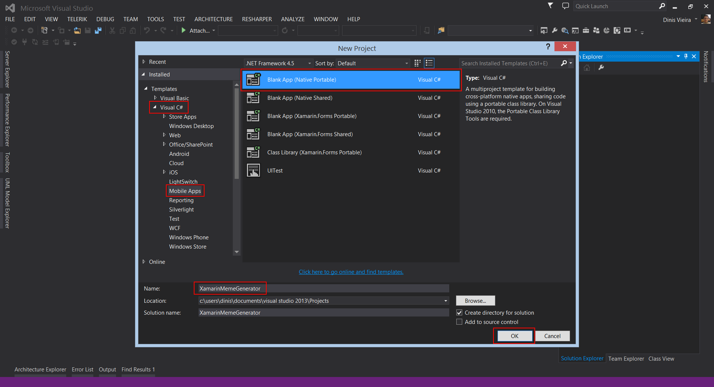
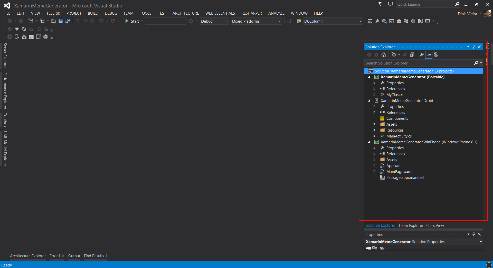

# Track 1 - Development with Windows #
You will develop a Windows Phone and Android application.  
It's also possible to create an iOS Application but that would require a Mac Build Host and it's not covered in this Guide.

## Before starting

* This guide applies to Visual Studio, but you shouldn't have any trouble following it with Xamarin Studio. (you can refer to the [Xamarin guides](http://developer.xamarin.com/guides/cross-platform/getting_started/introducing_xamarin_studio/) anyway)
* Make sure you have Xamarin installed (which will also install the Xamarin Visual Studio Plugin)

## Create Project

Open Visual Studio Community.

* 1) File => New => Project

* 2) Choose "Visual C#" => "Mobile Apps" => Blank App (Native Portable) => Give it a name and "Ok"

Visual Studio will generate a template for Android / iOS / Windows Phone using a Portable Class Library to share code.

> Note: If a "File Modification Detected" window pops up just press "Reload All"

We don't want iOS on this Guide so let's remove the generated iOS Project

* 3) Right-click the Xamarin project and select "Remove"

You Solution Explorer should look like this now:

> + XamarinMemeGenerator is our Portable Class Library, meant to share code between platforms.
> + XamarinMemeGenerator.Droid is the project specific to the Android platform.
> + XamarinMemeGenerator.WinPhone is the project specific to the Windows Phone platform.

* 4) Login / Create Xamarin Account (this might not be necessary if you have already done it in the past.
	* Tools => Xamarin Account => Login (Create Account if necessary)

## Let's get some work done

